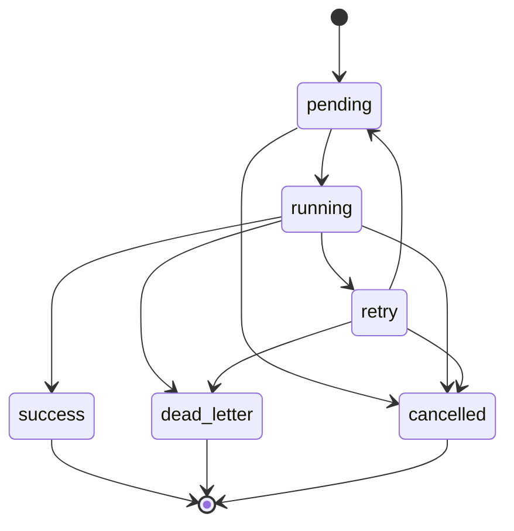

# Modelo de Colas y Caché en Zenoytdl

## Jobs y estados
Conjunto oficial de estados de jobs (alineado con hitos y pruebas):
- `pending`: job en cola, pendiente de ser tomado por un worker.
- `running`: job en ejecución activa.
- `success`: job completado correctamente.
- `retry`: job fallido con reintento programado y aún dentro del presupuesto de intentos.
- `dead_letter`: job fallido de forma terminal tras agotar reintentos o por error no recuperable.
- `cancelled`: job cancelado por operador o por apagado controlado antes de completarse.

## Transiciones válidas

Reglas de transición permitidas:
- `pending -> running`
- `pending -> cancelled`
- `running -> success`
- `running -> retry`
- `running -> cancelled`
- `running -> dead_letter`
- `retry -> pending`
- `retry -> cancelled`
- `retry -> dead_letter`

Reglas de consistencia:
- `success`, `dead_letter` y `cancelled` son estados terminales.
- No existe transición directa `pending -> success`.
- No existe reapertura de terminales (`success|dead_letter|cancelled`) a estados activos.

### Diagrama de transición de estados

## Colas
- cola simple inicial (Hito 17)
- procesamiento continuo con workers y concurrencia limitada (Hito 18)
- deduplicación obligatoria por `subscription_id + item_identifier + firma`
- parada segura con drenado de jobs en curso y cancelación explícita de pendientes

## Caché
- firma por item y configuración efectiva
- cache persistente
- invalidación selectiva
- métricas de hit/miss

Relación con colas:
- si hay `cache hit` válido, el job no se encola (deduplicación preventiva);
- si un job ya existe en `pending|running|retry`, no se debe duplicar;
- `dead_letter` conserva trazabilidad y no invalida automáticamente caché previa de éxito.

## Escenarios mínimos de regresión

1. **Éxito**: `pending -> running -> success` y registro consistente de intentos.
2. **Retry**: `pending -> running -> retry -> pending -> running -> success` dentro del límite.
3. **Dead-letter**: agotamiento de intentos con `running -> retry` repetido y cierre en `dead_letter`.
4. **Cancelación**: cancelación en `pending` y en `running`, ambas sin reapertura posterior.
5. **Deduplicación**: doble trigger del mismo item no crea job duplicado cuando ya existe uno activo o cuando aplica caché válida.

## Regla de validación por hito
Cada avance en cola o caché debe venir con pruebas específicas y regresión acumulada. Solo al cerrar el hito correspondiente puede reflejarse en el README como capacidad confirmada.

## Estado de soporte base en Hito 13
- Se incorpora persistencia preparatoria en SQLite con tablas `queue_backlog` y `cache_index`.
- Estas tablas son **solo estructura base** para evolución futura.
- No hay todavía workers, reintentos completos, deduplicación operativa final ni política de invalidación avanzada (Hitos 17+ y 16).

## Estado de implementación en Hito 16 (caché core)
- Caché en memoria para datos derivados del core:
  - validación semántica,
  - traducción a modelo ytdl-sub,
  - compilación de artefactos,
  - resolución de metadatos (`metadata.json -> profile_id`),
  - estado operativo reciente por suscripción.
- La fuente de verdad se mantiene en configuración efectiva y estado persistido; la caché solo reutiliza resultados derivados si el contexto sigue siendo válido.
- Invalidación soportada por:
  - cambios de fichero (fingerprint `mtime_ns + size`),
  - cambio de hash de contenido,
  - cambio de firma global de configuración,
  - cambio específico de `ytdl-sub-conf`,
  - TTL por scope,
  - purga manual por scope o total,
  - invalidación por error.
- Métricas hit/miss por scope disponibles para inspección y pruebas (`metrics_snapshot`).
- En caso de duda o inconsistencia, se fuerza miss y recomputación para priorizar corrección sobre velocidad.
