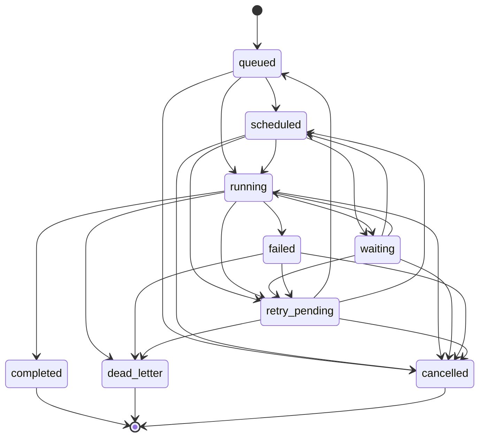

# Modelo de Colas y Caché en Zenoytdl

## Jobs y estados
Conjunto oficial de estados de jobs (alineado con hitos y pruebas):
- `queued`: job creado en cola persistida.
- `scheduled`: job planificado para ejecución posterior.
- `running`: job en ejecución activa.
- `waiting`: job en espera por dependencia externa/recurso.
- `completed`: job completado correctamente.
- `failed`: job fallido (sin consumirlo automáticamente).
- `retry_pending`: job marcado para posible reintento futuro.
- `cancelled`: job cancelado por operador o apagado controlado.
- `dead_letter`: job fallido terminal.

## Transiciones válidas

Reglas de transición permitidas:
- `queued -> scheduled|running|cancelled`
- `scheduled -> running|waiting|retry_pending|cancelled`
- `running -> waiting|completed|failed|retry_pending|cancelled|dead_letter`
- `waiting -> scheduled|running|retry_pending|cancelled`
- `failed -> retry_pending|cancelled|dead_letter`
- `retry_pending -> queued|scheduled|cancelled|dead_letter`

Reglas de consistencia:
- `completed`, `dead_letter` y `cancelled` son estados terminales.
- No existe transición directa `queued -> completed` sin pasar por estado operativo.
- No existe reapertura de terminales (`completed|dead_letter|cancelled`) a estados activos.

### Diagrama de transición de estados

## Colas
- cola simple inicial (Hito 17)
- procesamiento continuo con workers y concurrencia limitada (Hito 18)
- deduplicación obligatoria por `subscription_id + item_identifier + firma`
- parada segura con drenado de jobs en curso y cancelación explícita de pendientes

## Caché
- firma por item y configuración efectiva
- cache persistente
- invalidación selectiva
- métricas de hit/miss

Relación con colas:
- si hay `cache hit` válido, el job no se encola (deduplicación preventiva);
- si un job ya existe en `queued|scheduled|running|waiting|retry_pending`, no se debe duplicar;
- `dead_letter` conserva trazabilidad y no invalida automáticamente caché previa de éxito.

## Escenarios mínimos de regresión

1. **Éxito**: `queued -> running -> completed` y registro consistente de intentos.
2. **Retry-pending**: `queued -> running -> failed -> retry_pending -> queued` (sin activación automática en este hito).
3. **Dead-letter**: transición terminal controlada hacia `dead_letter`.
4. **Cancelación**: cancelación en `queued` y en `running`, ambas sin reapertura posterior.
5. **Deduplicación**: doble trigger del mismo item no crea job duplicado cuando ya existe uno activo o cuando aplica caché válida.

## Regla de validación por hito
Cada avance en cola o caché debe venir con pruebas específicas y regresión acumulada. Solo al cerrar el hito correspondiente puede reflejarse en el README como capacidad confirmada.

## Estado de implementación en Hito 17 (colas: modelo + persistencia)
- Se consolida `queue_backlog` como modelo de jobs persistidos en SQLite.
- Se soportan clases de cola: `validation`, `compilation`, `sync`, `download`, `postprocessing`, `maintenance`.
- Se soportan prioridades y orden por prioridad para consulta operativa.
- Se soporta firma canónica para deduplicación de jobs activos.
- Se soporta asociación del job a `subscription_id`, `profile_id` y/o recurso (`resource_kind`, `resource_id`).
- Aún no hay workers reales, dispatcher automático, retries activos ni concurrencia (Hito 18+).

## Estado de implementación en Hito 16 (caché core)
- Caché en memoria para datos derivados del core:
  - validación semántica,
  - traducción a modelo ytdl-sub,
  - compilación de artefactos,
  - resolución de metadatos (`metadata.json -> profile_id`),
  - estado operativo reciente por suscripción.
- La fuente de verdad se mantiene en configuración efectiva y estado persistido; la caché solo reutiliza resultados derivados si el contexto sigue siendo válido.
- Invalidación soportada por:
  - cambios de fichero (fingerprint `mtime_ns + size`),
  - cambio de hash de contenido,
  - cambio de firma global de configuración,
  - cambio específico de `ytdl-sub-conf`,
  - TTL por scope,
  - purga manual por scope o total,
  - invalidación por error.
- Métricas hit/miss por scope disponibles para inspección y pruebas (`metrics_snapshot`).
- En caso de duda o inconsistencia, se fuerza miss y recomputación para priorizar corrección sobre velocidad.

## Estado de implementación en Hito 18 (colas: ejecución, retries y concurrencia)
- Workers operativos en proceso único (`QueueRuntime`) con selección por prioridad.
- Concurrencia controlada por dos límites testeables:
  - máximo global de workers por ciclo,
  - máximo de jobs simultáneos por `subscription_id`.
- Deduplicación efectiva en dos niveles:
  - inserción persistida por firma canónica en estados activos,
  - deduplicación operativa por claim atómico (`claim_queue_job`) que evita doble ejecución.
- Reintentos con backoff exponencial acotado (`RetryPolicy`) y programación por `scheduled_at`.
- Clasificación recuperable/no recuperable basada en severidad de ejecución para decidir retry o `dead_letter`.
- Dead-letter persistente en `queue_dead_letter` con causa, intentos y trazabilidad temporal.
- Integración con caché: cacheo de resultados exitosos por firma para evitar retrabajo inmediato en el scheduler.
- Garantía explícita de incompatibilidad: no se ejecutan en paralelo jobs de la misma suscripción cuando `max_concurrent_by_subscription=1`.
- Alcance intencional del hito: implementación single-process; sin coordinación distribuida ni workers remotos.
